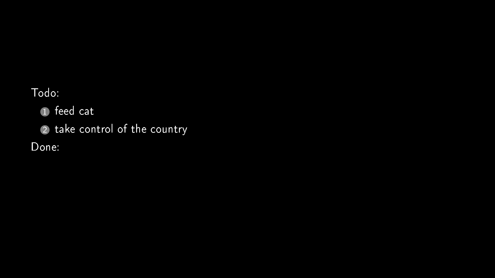
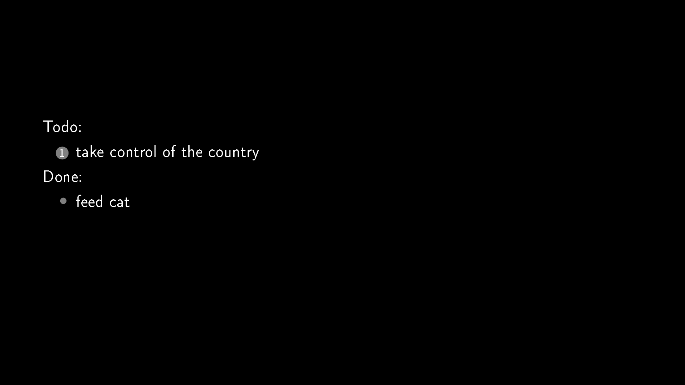

# To do background system

To do background system is an application that shows tasks directly on wallpaper.

## Requirements
```
python3
texlive
poppler-utils
feh
```
You can install them on your own or by running install_requirements.sh script.
```sh
$ sudo ./install_requirements.sh
```
## Installation

```bash
$ git clone https://github.com/td236/Todo-background-system.git
$ cd Todo-background-system
$ ./setup.sh
```

## Usage

Adding tasks.  
./add [task name]
```bash
$ ./add feed cat
$ ./add take control of the country
```

Finishing tasks.  
./finish [task number]  
Task number is visible on wallpaper.
```bash
$ ./finish 1
```

## Contributing
Pull requests are welcome. For considerable changes, please open an issue first to discuss what you would like to change.

## License
MIT
